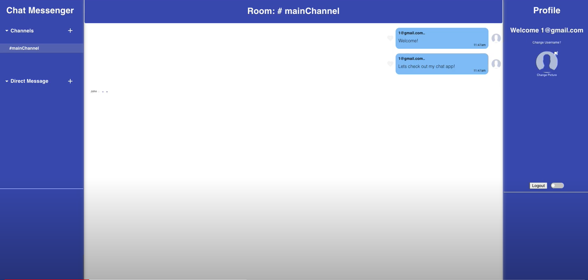

## Messenger/Slack clone

An instant chat messenger built with Firebase Cloud.

## Tech/Framework:

1. React.js
2. Firebase/Firestore
3. Axios
4. React context API

## Installations:
1. Add API keys - see Adding API Key dependencies
2. npm install
3. npm start
4. Head to http://localhost:3000 on the browser

## Adding API Key Dependencies:
This program requires the following API keys. These can be obtained here(folow the instructions of website links)
1. Create firebase project paste config in firebase.js(https://firebase.google.com/docs)

## Features

- realtime messaging
- create channels
- direct messages
- likes
- uploadphotos
- user authentication
- typing indication
- online indication
- dark mode

## Walkthrough

Please click to watch

